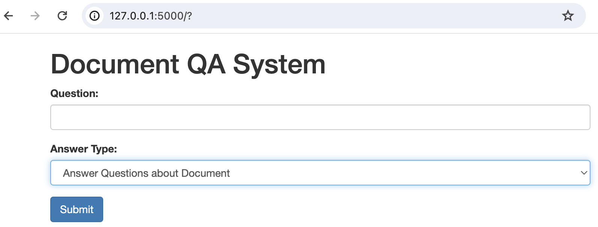

# Document-Question-Answering-System

## Apply LLM to Your Documents for Question-Answering

This repository utlizes LLM, or [OpenAI ChatGPT API](https://platform.openai.com/docs/guides/text-generation/json-mode) to create an app for question-answering for the contents in documents.     


## Setup Environment  

Download python libraries:

```
pip install -r requirements.txt
```

## Preprocess Documents for Similarity Search 

To vectorize documents for the question-answering system, use [sentence transformers](https://sbert.net/) with example instructions [here](https://sbert.net/#usage). Convert each section of the document into a single vector, and save to `vectors.pkl`. The original document can be saved as `document.pkl` with same order as their corresponding vectors. 

```
from sentence_transformers import SentenceTransformer
model = SentenceTransformer("all-MiniLM-L6-v2")

# document sections to encode
sections = [
    "Chapter 1 Lorem ipsum dolor sit amet, consectetur adipiscing elit...",
    "Chapter 2 Sed do eiusmod tempor incididunt ut labore et dolore magna aliqua...z",
    "Chapter 3 Ut enim ad minim veniam, quis nostrud exercitation..."
]

# Sentences are encoded by calling model.encode()
embeddings = model.encode(sentences)
```

## Run App with OpenAI API

In terminal or cmd run: 

```
flask run
```

Question-Answering Application should open up in browser `http://127.0.0.1:5000`: 



## Run App with Local LLM 

The `local_llm_app.py` script is compatible with [**Mistral-7B-Instruct-v0.1-GGUF**](https://huggingface.co/TheBloke/Mistral-7B-Instruct-v0.1-GGUF). Download gguf model and set filepath in environment variable `MODEL_PATH`. 

```
flask run local_llm_app
```


